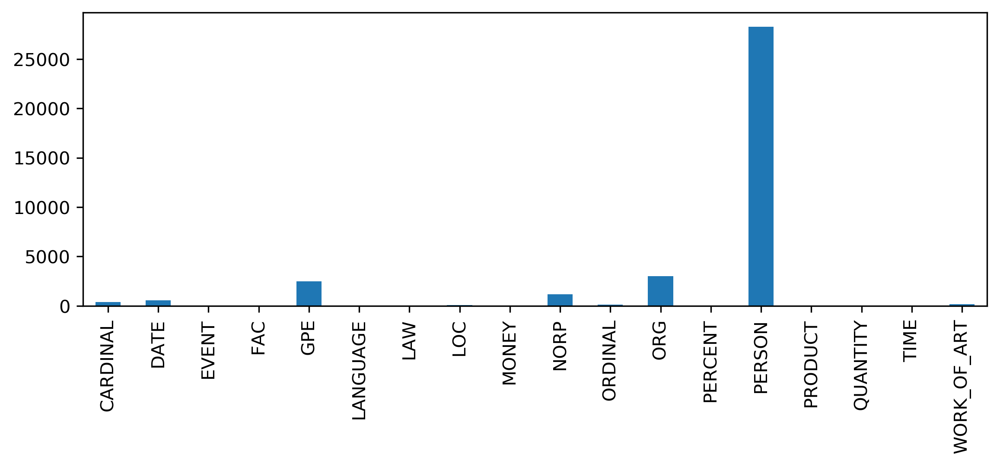
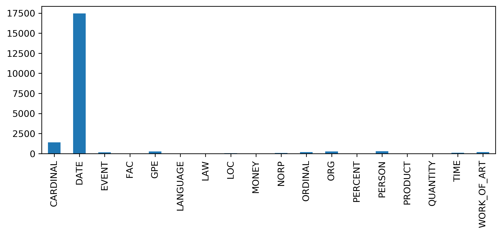
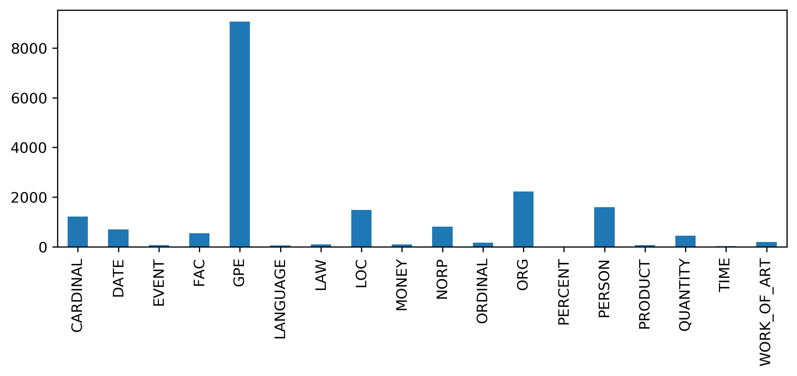
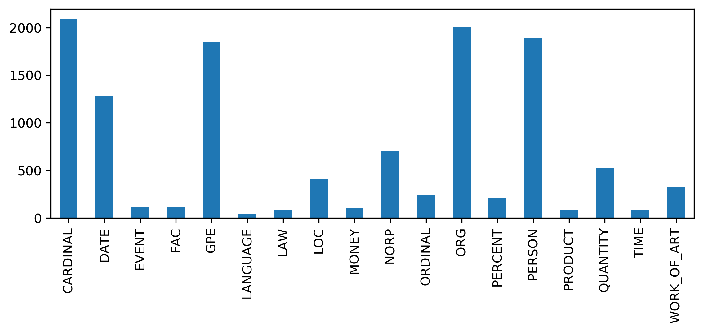
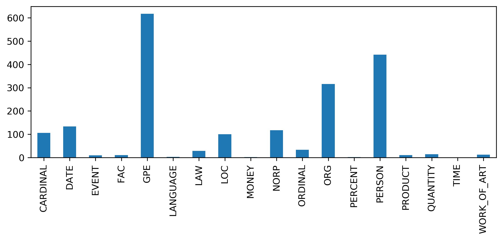

# EPiQ-A

## Team members
* Marinco Möbius (moebius@cl.uni-heidelberg.de)
* Jin Huang (huang@cl.uni-heidelberg.de)
* Leander Girrbach (girrbach@cl.uni-heidelberg.de)
* Rebekka Hubert (hubert@cl.uni-heidelberg.de)

## Existing code
Each pipeline step has its own README that states what pre-existing code/data was used.

## Requirements

All requirements are given in requirements.txt

## Installation

First install the requirements, change into the `src` folder  and then run `pip install . --editable` to continue development. Otherwise run `pip install .`

## Project State

### Planning State

At this stage, the datasets have been preprocessed. We have also implemented the basic components of our application, though all can be further improved.

In detail, this means that we can preprocess questions, extract named entities from questions and heuristically determine the question focus and synonyms to keywords in the question. Also we can build an inverted index from a collection of documents. By applying ranking mechanisms with regard to a question we can extract the documents from the collection most likely to contain the answer the question. Finally, we can extract the most relevant passages from the retrieved documents, extracting the best answer span from the relevant passages is still in progress.

The interaction between the pipeline parts is still fragile at best and requires further improvement. Due to this, we have not yet started on our overall goal: The error-awareness. Furthermore, we have not evaluated the pipeline in total, but have taken a look at the performance of the singular components.

### Future Planning

Our next goals are to connect the components of the pipeline to enable a seamless, easy end-to-end usage as  advised by our mentor and to extract the best answer span form the most relevant passages. We believe this can be easily done before the new year starts.
Then, we will address our main goal: The error-correction in the different components. We believe this will take the most of our remaining time.
Finally, we may improve our different pipeline components by either adding more features or implementing less simple algorithms to improve our  results.

### High-level Architecture Description:
There are two parts to the project: Data preprocessing and the application pipeline. The pipeline is constructed of three different parts: The construction of the semantic representation of the query, the retrieval of articles that may contain the answer to the query and the extraction of the answer from the retrieved articles. Each of these parts has its on module in the `src` folder. In the following, we will describe each pipeline step in detail. Further implementation details are given in each module's README.

Given a question, it is necessary to extract information needed for retrieving the answer. This includes primarily finding keywords, e.g. by tokenising, filtering stopwords, and optionally lemmatising.

Besides question keywords, recognising named entities is useful both for extracting answers and retrieving documents. Also, to deal with synonymy and sparsity (questions are generally short), we collect synonyms or closely related words to all keywords of the question.

Previous work on question answering has shown that finding out the question type, e.g. whether the question asks for a definition, number, etc. can help identifying good answers. To this end, the main focus keyword of a question is extracted. For example, the focus keyword in "What is the longest river in Africa" is "river", because it directly specifies the expected answer, i.e. name of a river.

The article retrieval component works independently from this first step as this additional information is not required to extract the relevant articles. 
Note that the natural questions dataset has new articles in the development set, which is our test set. We need to add these articles to our training set, otherwise we cannot retrieve the correct articles as they would be unknown.

We first build an inverted index from the articles in the entire dataset: We lemmatize each tokenized word in the dataset. Then we remove stop words. The remaining words are used to build the index. Each word maps to a list of documents that contain this word.

For querying the document collection, the words in the lemmatised query are mapped to the articles via the inverted index and the retrieved articles are ranked with respect to the query. Currently, we have two ranking, bag-of-words methods implemented: The TF-IDF Weighting introduced in the lecture with cosine similarity to the TF-IDF vector of the query for ranking and Okapi BM25. Note that our current implementation of TF-IDF uses [sklearns](https://scikit-learn.org/stable/modules/generated/sklearn.feature_extraction.text.TfidfVectorizer.html) default parameters.
For the Okapi BM25 we use the implementation provided by the python package [gensim](https://radimrehurek.com/gensim_3.8.3/summarization/bm25.html).
Regardless of the chosen ranking model we pass the top ten ranked articles to the answer extraction component.

There are two main tasks to extract accurate answers to questions in the retrieved articles: 1) retrieve informative/relevant paragraphs in the article, and 2) extract the answer from those paragraphs. 

To extract the relative paragraphs from the articles, we use BM25 (implemented by gensim). It takes a query and sorts the paragraphs based on how relevant they are for the query. Then the top N paragraphs will be extracted by BM25 and we will build a article out of all those top N paragraphs as the final informative answer containing context for the question.

For question answering, transformers provides models that are fine-tuned checkpoints of DistilBERT(a simpler and faster version of Google's BERT model which still keeps most of the original model performance) or BERT, they are fine-tuned using knowledge distillation on SQuAD v1.1. They are models with a span classification head on top for extractive question-answering tasks like SQuAD (a linear layers on top of the hidden-states output to compute span start logits and span end logits).

The pre-trained models distilbert-base-uncased-squad2 and bert-large-uncased-whole-word-masking-finetuned-squad from transformers can tokenize the question context(answer) and find the tokens for the answer. This model can answer "yes/no questions" with a sentence instead of "yes/no" answers, thus we might also solve this problem.
We built our component upon the blog-post https://programmerbackpack.com/bert-nlp-using-distilbert-to-build-a-question-answering-system/ and adapt the freely available code to our case.

### Experiments 

At the moment we test each pipeline independently in order to assure a level of quality of each component.

So far, we have evaluated the article retriever with the Okapi BM25 ranking model automatically. Because our dataset contains only one correct article, we focus on the rank the module assigns to the correct document: We calculate R-precision.
Because our goal is for the one correct article to be ranked as high as possible we also compute Mean Reciprocal Rank (MMR).

| Model       |      Metric |    Test |
|-------------|------------:|--------:|
| Opaki BM25  | R-precision |  0.0008 |
| TF-IDF cos. | R-precision |  0.1769 |
| Opkai BM25  |         MMR |  0.0017 |
| TF-IDF cos. |         MMR |  0.2696 |

These results show that we may easily improve upon our current method. As soon as we fine-tune the model, our results will improve to some extent. Note that though the TF-IDF weighting ranking method achieves far better results, it is more than 10x slower than the Opaki BM25 weighting ranking model.

## Data Analysis

### Data Sources 

* [WikiMovies](https://research.fb.com/downloads/babi/):  
This dataset was dropped as it doesn't contain a direct association of question to Wikipedia article.

* [ConvQuestions](https://convex.mpi-inf.mpg.de/):  
We still intend to use this dataset, but it shrank substantially after preprocessing. We noticed that the dataset contains a lot of duplicates. 

* [NaturalQuestions](https://ai.google.com/research/NaturalQuestions/dataset):  
The main data source for our project. 

### Preprocessing 

#### Conv Questions

Like the name indicates, this dataset consists out of a number of **conversation threads** (**Question** & **Answer**), each belonging to one of the following domains: *books*, *movies*, *music*, *soccer*, *series*. Each conversation has multiple questions -- we only extract the first question as the subsequent questions are dependent on the first question and could only be interpreted in context.

Each conversation has a **seed entity** which started the conversation. For each entity they include the **link to Wikidata** (e.g. [American Hustle](https://www.wikidata.org/wiki/Q9013673) ). As we want an association of question/answer to Wikipedia, we first need to resolve this. Most Wikidata pages provide such a link to their respective Wikipedia page. We use the [query service](https://query.wikidata.org/) of Wikidata to receive the Wikipedia URL and then download and clean the article. 

From an Wikipedia article we parse the infobox, the headings and text and tables from the paragraphs. We remove HTML markup and footnote superscripts to receive plain text, additionally we skip unwanted sections (*References*, *Footnotes*, *Notes*, *See also*, ...). At the end we tokenize the article.

We organized the final data into a set of triples (question, answer, Wikipedia-URL) and a lookup of Wikipedia-URL and its text (tokens).

#### Natural Questions

This rather large dataset (~ 300k/8k/8k train/dev/test) provides for each **question** a **long answer** and a **Wikipedia-URL** from which the answer was selected, if possible they also included a **short answer**. 

They also include the HTML of the Wikipedia pages and the size of the training set amounts to 41 GB in total, but they also provide a simplified version with only the text (4GB in total). This simplified version is only available for the train set. It is therefore needed to convert the dev set into the same format. The test set is not publicly available. They also provide a conversion script, but it is geared for their pipeline and it would have been more work to integrate it than to do this ourselves.  

We only focus on questions with short answers or Yes/No answers (marked separately in the dataset). We discard the rest. We resolve the answer spans to text and clean the provided Wikipedia article in the same way as for the ConvQuestions dataset (remove HTML and unwanted sections).

The data is organized again in the same format as for the previous dataset.

### Basic Statistics

Number of documents in ConvQuestions before/after preprocessing (reduction due to duplicates):
|     CQ | train | dev  | test |
|-------:|------:|------|------|
| before |  6720 | 2240 | 2240 |
|  after |   414 | 136  | 140  |

Number of documents in NaturalQuestions before/after preprocessing (reduction due to filter of only short answers):
|     NQ |  train | dev  |
|-------:|-------:|------|
| before | 307373 | 7830 |
| after  | 110724 | 2662 |

85 \% of questions in ConvQuestions contain one of the following question words:

88 \% of questions in NaturalQuestions contain one of the following question words:

Top 10 of the most frequent auxiliary verbs or other words in NaturalQuestions when there is no w-question:

Distribution of Named Entity in answer in dependence of question word (NaturalQuestions dataset):

* **who**

* **when**

* **where**

* **what**

* **which**

### Examples

#### ConvQuestions

| Question                                                                      | Answer        | Wikipedia_ID                                      |
|:------------------------------------------------------------------------------|:--------------|:--------------------------------------------------|
| Which band produced the album known as the "dark side of the moon"?           | Pink Floyd    | https://en.wikipedia.org/wiki/Pink_Floyd          |
| Which actor starred in the tv series Two And A Half Men and Anger Management? | Charlie Sheen | https://en.wikipedia.org/wiki/Two_and_a_Half_Men  |
| Who wrote The Shining?                                                        | Stephen King  | https://en.wikipedia.org/wiki/The_Shining_(novel) |
| Taylor Swift's record label?                                                  | Big Machine Records                | https://en.wikipedia.org/wiki/Taylor_Swift          |

#### Natural Questions

| Question                                            | Answer                                                                                                          | Wikipedia_ID                                                                                                  |
|:----------------------------------------------------|:----------------------------------------------------------------------------------------------------------------|:--------------------------------------------------------------------------------------------------------------|
| what do the 3 dots mean in math                     | the therefore sign ( ∴ ) is generally used before a logical consequence , such as the conclusion of a syllogism | https://en.wikipedia.org//w/index.php?title=Therefore_sign&amp;oldid=815234923                                |
| who is playing the halftime show at super bowl 2016 | Coldplay with special guest performers Beyoncé and Bruno Mars                                                   | https://en.wikipedia.org//w/index.php?title=Super_Bowl_50_halftime_show&amp;oldid=823813276                   |
| who won the 2017 sports personality of the year     | Mo Farah                                                                                                        | https://en.wikipedia.org//w/index.php?title=2017_BBC_Sports_Personality_of_the_Year_Award&amp;oldid=816169117 |
| name of black man in to kill a mockingbird                         | Thomas `` Tom '' Robinson                                                                                                                                | https://en.wikipedia.org//w/index.php?title=List_of_To_Kill_a_Mockingbird_characters&amp;oldid=835936451                               |
